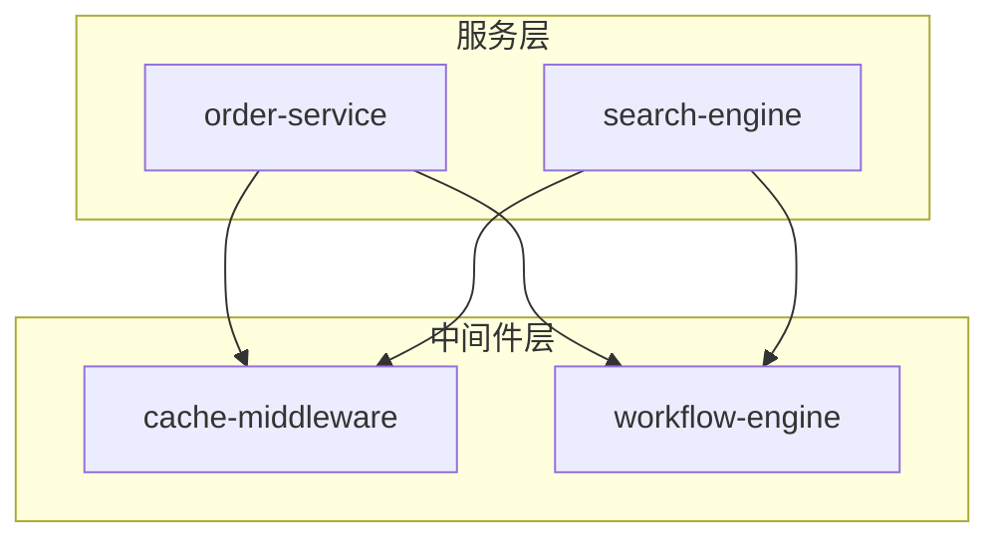

# Project Skill Generator (Meta-Skill)

## Overview

用于生成和维护项目/服务级Skill的元技能，实现Skill的半自动化生命周期管理。

**设计理念：**
- AI自动生成约70%内容（代码结构、接口契约、调用关系）
- 项目Owner补充约30%内容（业务意图、设计决策、踩坑经验）
- 通过符号引用+语义描述的混合方式提供容错性

## 默认代码路径

用户可在首次使用时指定项目代码的默认根目录。如果未指定，则每次生成时需手动提供路径。

**路径解析优先级：**

1. **用户显式指定** - 如果用户提供了代码路径，直接使用
2. **默认路径推断** - 拼接 `默认根目录 + 服务名称`，例如服务名为 `user-service`，默认根目录为 `~/projects/`，则推断路径为 `~/projects/user-service`
3. **询问用户** - 如果上述路径不存在或不可访问，则询问用户提供实际路径

**在生成Skill时的行为：**

```
解析代码路径(service_name):
  1. 如果用户指定了路径 → 使用用户路径
  2. 检查 {默认根目录}/{service_name} 是否存在
     ├── 存在 → 使用该路径，告知用户 "已自动定位代码路径: {默认根目录}/{service_name}"
     └── 不存在 → 询问用户: "未在默认路径下找到 {service_name}，请提供代码库路径"
```

**在生成的Skill中嵌入 `code_path` 字段：**

生成的每个项目Skill的 frontmatter 中必须包含 `code_path` 字段，记录该服务的代码路径，便于后续 validate/update 时自动定位代码：

```yaml
---
name: user-service
description: ...
code_path: ~/projects/user-service
last_verified: 2026-02-10
---
```

**在执行项目Skill时的路径解析：**

当用户触发一个已有项目Skill（如 validate、update 或在该Skill上下文中开发）时，按以下优先级定位代码：

1. Skill frontmatter 中的 `code_path` 字段
2. 默认路径 `{默认根目录}/{service_name}`
3. 以上都不可用时，询问用户

## 核心能力

### 1. generate - 生成新Skill

为指定服务生成Skill初稿。

**触发方式：** "帮我为 XXX 服务生成 Skill"

**输入要求：**
- 服务名称（必需）
- 代码库路径（可选，不提供时按默认路径推断）
- 现有设计文档路径（可选，有则优先参考）

**执行流程：**

```
0. 路径解析阶段
   ├── 检查用户是否指定了代码路径
   ├── 未指定 → 尝试 {默认根目录}/{service_name}
   ├── 默认路径存在 → 使用并告知用户
   └── 默认路径不存在 → 询问用户提供路径

1. 代码扫描阶段
   ├── 识别入口类（Controller、Service接口）
   ├── 分析核心Service和Action类
   ├── 提取数据模型（BO、DTO、Entity）
   └── 识别外部依赖（Gateway、Client）

2. 架构分析阶段
   ├── 生成调用关系图
   ├── 识别核心业务流程
   └── 提取接口契约（入参、出参、错误码）

3. Skill生成阶段
   ├── 按标准模板填充各章节
   ├── 在frontmatter中写入 code_path 字段
   ├── 建立符号引用索引
   ├── 添加语义描述作为兜底
   └── 标记"待确认"的业务意图

4. 输出
   ├── SKILL.md 初稿
   └── 待Owner确认的问题清单
```

**分析重点：**

| 分析项 | 识别方法 | 输出位置 |
|-------|---------|---------|
| 入口服务 | `@Service`、`@Controller`、`implements XXXService` | Architecture |
| 核心模块 | 调用频率高、被多处依赖的类 | Core Modules |
| 数据流 | 方法参数和返回值的传递链 | Architecture |
| 外部依赖 | `Gateway`、`Client`、`@Autowired` 外部服务 | Dependencies |
| 配置项 | `@Value`、配置中心注解、Properties 文件 | Dependencies |

### 2. validate - 检查Skill时效性

检查现有Skill与代码库的同步性。

**触发方式：** "检查 XXX Skill 是否过期"

**输入要求：**
- Skill文件路径
- 对应代码库路径（可选，优先从Skill的 `code_path` 字段读取，其次默认路径推断，都不可用时询问用户）

**执行流程：**

```
0. 路径解析阶段
   ├── 读取Skill frontmatter中的 code_path
   ├── code_path有效 → 使用该路径
   ├── code_path无效 → 尝试默认路径 {默认根目录}/{service_name}
   └── 都不可用 → 询问用户

1. 解析Skill中的符号引用
   ├── 提取所有 `ClassName.methodName()` 格式的引用
   └── 提取所有 `ClassName` 格式的类引用

2. 代码库验证
   ├── 检索每个符号是否存在
   ├── 对比方法签名是否变化
   └── 检查类是否被重命名或删除

3. 生成验证报告
   ├── 有效引用列表
   ├── 失效引用列表（需更新）
   └── 新增核心类（建议补充）
```

**输出示例：**
```
验证报告：order-service Skill

✓ 有效引用：23个
✗ 失效引用：2个
  - PaymentAction.processPayment() → 方法已重命名为 doExecute()
  - OldValidationFilter → 类已删除

⚠ 建议补充：
  - NewRiskCheckAction (新增核心类，被3处引用)
```

### 3. update - 辅助更新Skill

根据变更说明辅助更新Skill内容。

**触发方式：** "更新 XXX Skill，我重构了某模块"

**输入要求：**
- 现有Skill路径
- 变更说明（自然语言描述变更内容）
- 代码库路径（可选，优先从Skill的 `code_path` 字段读取，其次默认路径推断）

**执行流程：**

```
0. 路径解析阶段
   ├── 读取Skill frontmatter中的 code_path
   ├── code_path有效 → 使用该路径
   ├── code_path无效 → 尝试默认路径 {默认根目录}/{service_name}
   └── 都不可用 → 询问用户

1. 理解变更范围
   ├── 解析变更说明，识别影响的模块
   └── 对比代码库当前状态与Skill描述

2. 定向更新
   ├── 只更新受影响的章节
   ├── 保留未变更的内容
   └── 更新符号引用

3. 输出
   ├── 更新后的SKILL.md
   └── 变更diff对比
```

### 4. graph - 生成Skill图谱

基于所有Skill的引用关系，生成服务间依赖可视化图谱。

**触发方式：** "生成Skill图谱" / "展示服务依赖关系"

**输入要求：**
- Skill目录路径（默认 `~/.qoder/skills/`）

**执行流程：**

```
1. 扫描Skill目录
   ├── 读取所有SKILL.md文件
   └── 提取name和description

2. 解析引用关系
   ├── 识别 @ref:xxx-skill 格式的引用
   └── 构建依赖邻接表

3. 生成图谱
   ├── 输出Mermaid格式依赖图
   ├── 标注节点类型（服务级/模块级/中间件级）
   └── 高亮孤立节点和循环依赖
```

**输出示例：**


**应用场景：**
- **影响分析**：修改中间件Skill时，快速识别受影响的服务
- **依赖治理**：发现循环依赖或过度耦合
- **知识导航**：新人快速了解服务全景

## Skill 标准模板

生成Skill时遵循以下结构，详见 [references/skill-template.md](references/skill-template.md)：

```markdown
---
name: {service-name}
description: {一句话描述}。适用场景：(1) ... (2) ... (3) ...
code_path: {代码库绝对路径}
---

# {服务名称} Skill

## Overview
- 服务定位和业务价值
- 核心能力列表

## Architecture
- 架构图（ASCII或描述）
- 数据流说明

## Core Modules
- 按模块组织（如：召回/过滤/排序、输入/处理/输出等）
- 每个模块包含：基类、实现类、关键方法

## Dependencies
- 内部依赖（Gateway、Config）
- 外部依赖（中间件、外部服务）

## Usage Patterns
- 典型扩展场景的代码模板

## Pitfalls & Notes
- 踩坑经验和注意事项
```

## 代码分析策略

### Java/Spring 项目

```
识别模式：
├── 入口层：@Controller, @RestController, @Service(实现类)
├── 业务层：继承特定基类的Action、Handler、Processor
├── 数据层：@Repository, Gateway接口及实现
├── 配置层：@Configuration, @Value 字段
└── 模型层：BO, DTO, VO, Entity后缀的类
```

### 工作流引擎项目

```
识别模式：
├── 流程定义：workflow/*.json 或 BPMN 文件
├── Action节点：extends BaseAction
├── 上下文：XXXContextBO / XXXContext
└── 数据网关：XXXGateway接口
```

## 使用示例

### 生成新Skill

```
用户：帮我为 order-service 服务生成 Skill

AI：好的，检测到默认路径 ~/projects/order-service 存在，
    已自动定位代码路径，开始分析代码库并生成Skill初稿。
    [执行代码扫描和架构分析]
    
    已生成 Skill 初稿（code_path 已写入 frontmatter），以下是需要你确认的问题：
    1. 服务的主要业务场景是什么？
    2. 支付模块中 PaymentAction 的设计决策是什么？
    3. 有哪些踩坑经验需要补充？
```

### 生成新Skill（默认路径不存在）

```
用户：帮我为 my-new-service 服务生成 Skill

AI：未在默认路径 ~/projects/my-new-service 下找到代码，
    请提供该服务的代码库路径。

用户：在 ~/workspace/my-new-service

AI：好的，开始分析 ~/workspace/my-new-service ...
    [执行代码扫描和架构分析]
    
    已生成 Skill 初稿（code_path 已设置为 ~/workspace/my-new-service），
    以下是需要你确认的问题：
    ...
```

### 检查Skill时效性

```
用户：检查一下 order-service Skill 是否过期

AI：从Skill的 code_path 字段读取到代码路径：~/projects/order-service
    正在验证Skill中的符号引用...
    
    验证结果：
    - 23个引用有效
    - 2个引用已失效，建议更新
    - 发现1个新增核心类，建议补充到Skill中
    
    是否需要我帮你更新这些内容？
```

### 更新Skill

```
用户：更新 order-service Skill，我新增了一个风控校验模块

AI：好的，我来更新Skill中的相关模块部分。
    
    [分析新增的风控Action]
    
    已更新以下内容：
    - Core Modules：新增「风控校验模块」章节
    - Dependencies：新增 risk-check-service 依赖
    - Usage Patterns：更新扩展示例
    
    请确认变更是否正确。
```

### 生成Skill图谱

```
用户：生成Skill图谱，看看服务间的依赖关系

AI：正在扫描 ~/.qoder/skills/ 目录...
    
    发现 5 个Skill，依赖关系如下：
    
    [Mermaid 依赖图]
    
    分析结果：
    - 无循环依赖
    - cache-middleware 被3个服务依赖（核心中间件）
    - project-skill-generator 为孤立节点（Meta-Skill，无业务依赖）
```

## 维护建议

### 触发更新的时机

| 场景 | 更新方式 |
|-----|---------|
| 代码重构/架构变更 | 主动执行 update |
| 新增踩坑经验 | 手动补充到 Pitfalls |
| 定期巡检 | 执行 validate 检查 |
| 使用时发现不准确 | 即时修正 |

### 版本管理

- Skill文件建议纳入代码仓库（或独立仓库）
- 在Skill头部添加 `last_verified: YYYY-MM-DD` 标记
- 重大变更时记录变更日志

## 注意事项

1. **生成的是初稿** - AI生成的内容需要项目Owner Review和补充
2. **业务意图无法自动推断** - 设计决策、业务背景需要人工补充
3. **符号引用有容错** - 即使类名变化，语义描述仍可帮助定位
4. **渐进式完善** - 踩坑经验在后续使用中逐步积累
